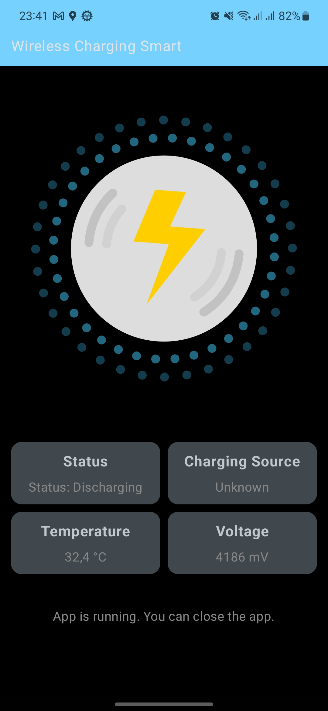

# wireless-charge-optimize

Welcome to wireless-charge-optimize, our Battery Monitoring Application!

This innovative tool is designed to revolutionize your wireless charging experience.

It continuously monitors your phone's battery level and, when necessary, communicates seamlessly via MQTT to your wireless charger. This means your device will not only charge when it needs to but also stop charging intelligently, helping to extend your battery's lifespan.\
Say goodbye to overcharging and overheating issues, and say hello to enhanced battery health and device longevity

## Timeline
- [x] Completed the development of the demonstration application
- [ ] Develop a settings page within the application to configure battery charging and discharging levels
- [ ] Add functionality to connect the device to the application and enable configuration settings.
- [ ] Publish the application on the Google Play Store for users to download and use.

## Demo
Application\
\
Device\
\
Connect to xiaomi wireless charger\

## License:

This project is distributed under the [MIT](https://opensource.org/licenses/MIT) license.